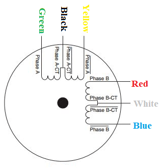

# StepperMotor_ArduinoMotorShield_NEMA17
Programming of Arduino 2A Motor Shield with NEMA17 Stepper Motor

## Hardware Used 
1. Arduino Uno
2. [Arduino 2A Motor Shield](https://my.cytron.io/p-0.8amp-5v-26v-dc-motor-driver-shield-for-arduino-2-channels?r=1) : [User Manual](https://docs.google.com/document/d/1EiQAE_9VpDDm4rjZrySAoGjQldJnTk6rJIsUkqCT37w/view)
3. [NEMA 17 Stepper Motor](https://www.alibaba.com/product-detail/42mm-stepper-motor-JK42HS40-1204D-NEMA17_60232212584.html)

## Wiring Configuration
The NEMA 17 stepper motor has two coils. The two ends of each coil are connected to one motor output on the shield. The centre tap wires (black and white) can be ignored.

| Motor Shield    | NEMA 17 Motor   |
|-----------------|-----------------|
| Motor 1A        | green           | 
| Motor 2A        | yellow          | 
| Motor 1B        | red             | 
| Motor 2B        | blue/purple     |

## Software
The [Arduino Stepper library](https://www.arduino.cc/reference/en/libraries/stepper/) is used. The programs are based off its inbuilt examples **stepper_oneRevolution** and **stepper_oneStepAtATime**. 

1. One Step at a Time: motor moves one step at a time, used to test motor wiring
2. Constant revolution: motor constantly revolves at selected speed in selected direction, used to test motor wiring
3. One Revolution: motor moves one revolution clockwise, then one revolution counter clockwise, and repeats

## Application 
[Reliability Test for Flexible Electronics](https://github.com/mcjy99/SimpleReliabilityTest)

## Note: 
1. For the NEMA 17 Stepper Motor tested, the datasheet states that for one coil black is the coil end and yellow is the centre tap wire, but it was found that the opposite is true.
2. Select the number of revolutions per step based on the motor used
3. These examples use Signed Magnitude mode on the shield.

